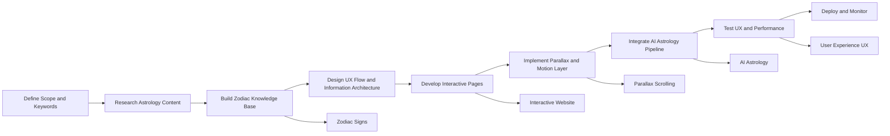
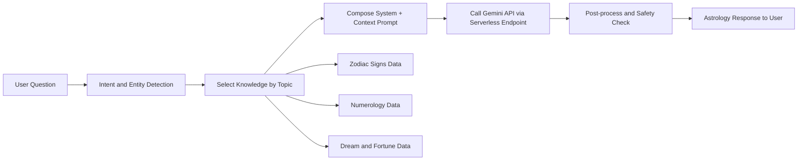
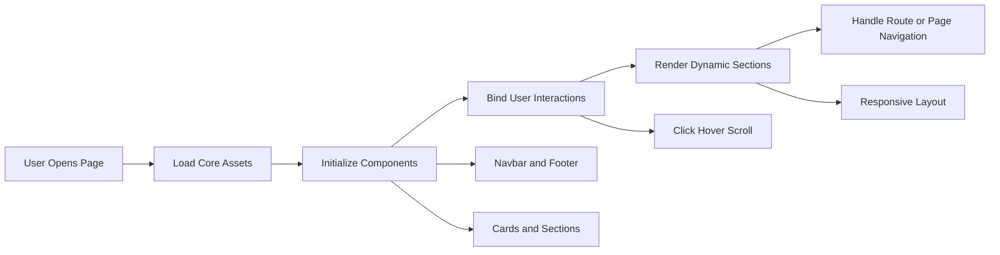
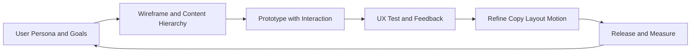

# Luckkana Star - AI-Powered Astrology Website

เว็บไซต์ดูดวงด้วย AI ที่มีการออกแบบสวยงามพร้อมเอฟเฟกต์พิเศษ

## 🌟 Features

### Animations
- **Circle Pulse**: วงกลมกระพริบด้วย CSS animation
- **Star Rotation**: ดาวหมุนรอบวงกลมอย่างต่อเนื่อง
- **Hands Parallax**: มือมีเอฟเฟกต์ parallax ตามการเลื่อนเมาส์และหน้าจอ

### Components
- **Navbar**: Navigation bar แบบ fixed พร้อม blur effect
- **Footer**: แถบข้อมูลด้านล่าง
- **CTA Button**: ปุ่ม "CHAT WITH STAR" ที่ตรงกลาง

### Design System
- สีหลัก: ดำและขาว
- Font: General Sans
- Icons: Font Awesome 6.5.1
- Responsive design สำหรับทุกขนาดหน้าจอ

## 📁 Project Structure

```
LUCKKANAPro/
├── index.html                 # หน้าหลัก
├── assets/
│   └── images/               # รูปภาพทั้งหมดจาก Figma
│       ├── circle1-5.png     # วงกลม 5 ชั้น
│       ├── star1-2.png       # ดาว
│       ├── hand-left.png     # มือซ้าย
│       ├── hand-right.png    # มือขวา
│       └── logo.svg          # โลโก้
├── css/
│   └── styles.css            # Styles หลัก
└── js/
    ├── components/
    │   ├── navbar.js         # Navbar component
    │   └── footer.js         # Footer component
    ├── animations.js         # Animation controller
    └── main.js               # Main app logic
```

## 🚀 Getting Started

### วิธีเปิดเว็บไซต์

1. เปิดไฟล์ `index.html` ด้วย browser
2. หรือใช้ Live Server ใน VS Code

### การใช้งาน Live Server

```bash
# ติดตั้ง Live Server (ถ้ายังไม่มี)
npm install -g live-server

# รันเซิร์ฟเวอร์
cd /Users/kongk/LUCKKANAPro
live-server
```

## 🎨 Design from Figma

โปรเจกต์นี้ถูกสร้างจาก Figma design:
- URL: https://www.figma.com/design/3zgsoVEjznUh124Elr4jsO/Untitled?node-id=35-61
- ใช้ Figma MCP เพื่อดึงข้อมูล design และ assets
- รูปภาพทั้งหมดถูกดาวน์โหลดจาก Figma โดยตรง

## 💡 Technical Details

### Animations
- **Circle Pulse**: CSS `@keyframes pulse` - 3 วินาที infinite
- **Star Rotation**: CSS `@keyframes rotateAroundCircle` - 20 วินาที linear infinite
- **Parallax**: JavaScript mousemove และ scroll events

### Responsive Breakpoints
- Desktop: > 1440px
- Tablet: 768px - 1440px
- Mobile: < 768px

## 🧪 Methodology (Keyword-Aligned)

**Keywords จาก Abstract:** AI Astrology, Interactive Website, Parallax Scrolling, User Experience (UX), Zodiac Signs

### 1) Methodology ภาพรวมการสร้างเว็บ



### 2) AI Astrology ทำอย่างไร (RAG + Prompt Pipeline)



### 3) Interactive Website ทำได้อย่างไร (Frontend Flow)



### 4) UX ออกแบบอย่างไร (Iterative UX Cycle)



### 5) Mapping: Keyword -> Implementation

- **AI Astrology** -> RAG retrieval + prompt composition + Gemini API integration
- **Interactive Website** -> component-based frontend + event-driven interactions
- **Parallax Scrolling** -> layered assets + scroll/mouse motion effects
- **User Experience (UX)** -> iterative testing loop + responsive optimization
- **Zodiac Signs** -> structured domain knowledge for personalized answers

## 🔧 Customization

### เปลี่ยนสี
แก้ไขใน `css/styles.css`:
```css
:root {
    --color-primary: #000000;
    --color-white: #ffffff;
}
```

### ปรับความเร็ว Animation
แก้ไขใน `css/styles.css`:
```css
.circle-5 {
    animation: pulse 3s ease-in-out infinite; /* เปลี่ยนเวลาตรงนี้ */
}
```

## 📝 Browser Support

- Chrome (แนะนำ)
- Firefox
- Safari
- Edge

## 🤝 Credits

- Design: Figma
- Icons: Font Awesome
- Fonts: Google Fonts (General Sans)
- Development: Built with Vanilla JavaScript, HTML5, CSS3
